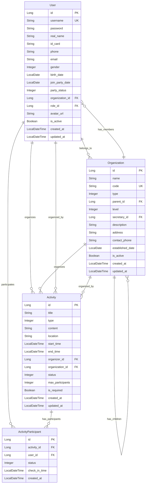

# 设计文档

## 概述

本文档详细描述了党建管理系统的技术架构和设计方案。系统采用现代化的前后端分离架构，后端使用Spring Boot框架，前端使用Vue.js框架，通过RESTful API进行数据交互。系统设计充分考虑了可扩展性、安全性和性能要求。

## 系统架构

### 总体架构

```
┌─────────────────────────────────────────────────────────────────┐
│                        前端层 (Frontend)                          │
│                  Vue 3 + Element Plus + Pinia                   │
└─────────────────────────────────────────────────────────────────┘
                                │
                                ↓ HTTP/HTTPS
┌─────────────────────────────────────────────────────────────────┐
│                        网关层 (Gateway)                           │
│                      Spring Security + JWT                        │
└─────────────────────────────────────────────────────────────────┘
                                │
                                ↓
┌─────────────────────────────────────────────────────────────────┐
│                        应用层 (Application)                       │
│                    Spring Boot + Spring MVC                      │
└─────────────────────────────────────────────────────────────────┘
                                │
                                ↓
┌─────────────────────────────────────────────────────────────────┐
│                        业务层 (Service)                           │
│                 Service Layer + Business Logic                   │
└─────────────────────────────────────────────────────────────────┘
                                │
                                ↓
┌─────────────────────────────────────────────────────────────────┐
│                        数据层 (Data)                              │
│                 Spring Data JPA + Database                        │
└─────────────────────────────────────────────────────────────────┘
```

### 技术栈

#### 后端技术栈
- **框架**: Spring Boot 2.7.14
- **安全**: Spring Security + JWT
- **数据访问**: Spring Data JPA
- **数据库**: H2 Database (开发环境) / MySQL (生产环境)
- **缓存**: Redis (可配置)
- **API文档**: OpenAPI 3.0 (SpringDoc)
- **构建工具**: Maven
- **Java版本**: JDK 11

#### 前端技术栈
- **框架**: Vue 3 + Vite
- **UI组件**: Element Plus
- **状态管理**: Pinia
- **路由**: Vue Router 4
- **HTTP客户端**: Axios
- **图表**: ECharts + Vue-ECharts
- **工具库**: Day.js, Lodash-es
- **CSS预处理**: Sass
- **构建工具**: Vite

## 组件和接口

### 核心模块设计

#### 1. 认证授权模块
```java
// JWT工具类
JwtUtils - 令牌生成、验证、解析
SecurityConfig - 安全配置
AuthController - 认证接口
UserService - 用户服务
RoleService - 角色服务
```

#### 2. 用户管理模块
```java
UserController - 用户管理接口
UserServiceImpl - 用户业务逻辑
UserRepository - 用户数据访问
User - 用户实体
```

#### 3. 组织架构模块
```java
OrganizationController - 组织管理接口
OrganizationServiceImpl - 组织业务逻辑
OrganizationRepository - 组织数据访问
Organization - 组织实体
```

#### 4. 活动管理模块
```java
ActivityController - 活动管理接口
ActivityServiceImpl - 活动业务逻辑
ActivityRepository - 活动数据访问
Activity - 活动实体
ActivityParticipant - 活动参与者实体
```

### API接口设计

#### RESTful API规范
```
GET    /api/v1/{resource}          - 获取资源列表
GET    /api/v1/{resource}/{id}     - 获取单个资源
POST   /api/v1/{resource}          - 创建资源
PUT    /api/v1/{resource}/{id}     - 更新资源
DELETE /api/v1/{resource}/{id}     - 删除资源
```

#### 主要API端点
```
# 认证相关
POST   /api/v1/auth/login          - 用户登录
POST   /api/v1/auth/logout         - 用户登出
GET    /api/v1/auth/profile        - 获取用户信息

# 用户管理
GET    /api/v1/users               - 获取用户列表
POST   /api/v1/users               - 创建用户
GET    /api/v1/users/{id}          - 获取用户详情
PUT    /api/v1/users/{id}          - 更新用户
DELETE /api/v1/users/{id}          - 删除用户

# 组织管理
GET    /api/v1/organizations       - 获取组织列表
POST   /api/v1/organizations       - 创建组织
GET    /api/v1/organizations/tree  - 获取组织树
PUT    /api/v1/organizations/{id}  - 更新组织
DELETE /api/v1/organizations/{id}  - 删除组织

# 活动管理
GET    /api/v1/activities          - 获取活动列表
POST   /api/v1/activities          - 创建活动
GET    /api/v1/activities/{id}     - 获取活动详情
PUT    /api/v1/activities/{id}     - 更新活动
POST   /api/v1/activities/{id}/register - 活动报名
POST   /api/v1/activities/{id}/checkin - 活动签到
```

## 数据模型

### 核心实体关系图



### 数据库设计

#### 用户表 (users)
| 字段名 | 类型 | 约束 | 描述 |
|--------|------|------|------|
| id | BIGINT | PK, AUTO_INCREMENT | 主键 |
| username | VARCHAR(50) | NOT NULL, UNIQUE | 用户名 |
| password | VARCHAR(255) | NOT NULL | 密码 |
| real_name | VARCHAR(50) | NOT NULL | 真实姓名 |
| id_card | VARCHAR(18) | 身份证号 |
| phone | VARCHAR(11) | 手机号 |
| email | VARCHAR(100) | 邮箱 |
| gender | TINYINT | 性别 (1:男 2:女) |
| birth_date | DATE | 出生日期 |
| join_party_date | DATE | 入党日期 |
| party_status | TINYINT | DEFAULT 1 | 党员状态 |
| organization_id | BIGINT | FK | 组织ID |
| role_id | BIGINT | FK | 角色ID |
| avatar_url | VARCHAR(500) | 头像URL |
| is_active | BOOLEAN | DEFAULT TRUE | 是否激活 |
| created_at | DATETIME | NOT NULL | 创建时间 |
| updated_at | DATETIME | 更新时间 |

#### 组织表 (organizations)
| 字段名 | 类型 | 约束 | 描述 |
|--------|------|------|------|
| id | BIGINT | PK, AUTO_INCREMENT | 主键 |
| name | VARCHAR(100) | NOT NULL | 组织名称 |
| code | VARCHAR(50) | UNIQUE | 组织编码 |
| type | TINYINT | NOT NULL | 组织类型 |
| parent_id | BIGINT | FK | 父组织ID |
| level | INT | DEFAULT 1 | 层级 |
| secretary_id | BIGINT | FK | 书记ID |
| description | TEXT | 描述 |
| address | VARCHAR(255) | 地址 |
| contact_phone | VARCHAR(20) | 联系电话 |
| established_date | DATE | 成立时间 |
| is_active | BOOLEAN | DEFAULT TRUE | 是否激活 |
| created_at | DATETIME | NOT NULL | 创建时间 |
| updated_at | DATETIME | 更新时间 |

#### 活动表 (activities)
| 字段名 | 类型 | 约束 | 描述 |
|--------|------|------|------|
| id | BIGINT | PK, AUTO_INCREMENT | 主键 |
| title | VARCHAR(200) | NOT NULL | 活动标题 |
| type | TINYINT | NOT NULL | 活动类型 |
| content | TEXT | 活动内容 |
| location | VARCHAR(255) | 活动地点 |
| start_time | DATETIME | 开始时间 |
| end_time | DATETIME | 结束时间 |
| organizer_id | BIGINT | FK | 组织者ID |
| organization_id | BIGINT | FK | 组织ID |
| status | TINYINT | DEFAULT 1 | 活动状态 |
| max_participants | INT | 最大参与人数 |
| is_required | BOOLEAN | DEFAULT FALSE | 是否必须参加 |
| created_at | DATETIME | NOT NULL | 创建时间 |
| updated_at | DATETIME | 更新时间 |

#### 活动参与者表 (activity_participants)
| 字段名 | 类型 | 约束 | 描述 |
|--------|------|------|------|
| id | BIGINT | PK, AUTO_INCREMENT | 主键 |
| activity_id | BIGINT | FK, NOT NULL | 活动ID |
| user_id | BIGINT | FK, NOT NULL | 用户ID |
| status | TINYINT | DEFAULT 1 | 参与状态 |
| check_in_time | DATETIME | 签到时间 |
| created_at | DATETIME | NOT NULL | 创建时间 |

## 安全设计

### 认证机制
- **JWT令牌**: 使用JWT进行无状态认证
- **令牌过期**: Access Token 24小时，Refresh Token 7天
- **密码加密**: 使用BCrypt加密存储密码
- **登录限制**: 连续失败5次锁定30分钟

### 权限控制
- **基于角色的访问控制 (RBAC)**: 实现细粒度权限管理
- **角色定义**: 系统管理员、党委书记、党支部书记、普通党员、入党积极分子
- **权限级别**: 功能权限 + 数据权限
- **前端路由守卫**: Vue Router导航守卫控制页面访问

### 数据安全
- **敏感数据加密**: 身份证号、手机号等敏感信息加密存储
- **SQL注入防护**: 使用参数化查询
- **XSS防护**: 输入验证和输出编码
- **HTTPS**: 生产环境强制使用HTTPS

## 性能设计

### 缓存策略
- **Redis缓存**: 缓存热点数据和用户会话
- **本地缓存**: 使用Caffeine缓存配置信息
- **数据库缓存**: 启用JPA二级缓存

### 数据库优化
- **索引优化**: 为查询频繁的字段创建索引
- **分页查询**: 所有列表查询支持分页
- **批量操作**: 支持批量数据导入导出
- **连接池**: 使用HikariCP连接池

### 前端性能
- **懒加载**: 路由懒加载和组件懒加载
- **虚拟滚动**: 大量数据列表使用虚拟滚动
- **图片优化**: 图片压缩和懒加载
- **代码分割**: 按需加载JavaScript代码

## 错误处理

### 异常处理体系
```java
// 自定义异常
BusinessException - 业务异常
ValidationException - 验证异常
AuthenticationException - 认证异常
AuthorizationException - 授权异常

// 全局异常处理器
GlobalExceptionHandler - 统一异常处理和错误响应
```

### 错误码规范
```
1xxx - 系统错误
1001 - 系统内部错误
1002 - 数据库连接失败
1003 - 缓存服务异常

2xxx - 认证授权错误
2001 - 用户名或密码错误
2002 - 令牌无效或过期
2003 - 权限不足

3xxx - 业务逻辑错误
3001 - 数据验证失败
3002 - 资源不存在
3003 - 操作冲突

4xxx - 客户端错误
4001 - 请求参数错误
4002 - 请求格式错误
4003 - 文件上传失败
```

## 测试策略

### 单元测试
- **测试框架**: JUnit 5 + Mockito
- **测试覆盖率**: 目标80%以上
- **测试范围**: Service层、Controller层、工具类

### 集成测试
- **数据库测试**: 使用H2内存数据库
- **API测试**: 测试RESTful接口
- **安全测试**: 测试认证授权机制

### 前端测试
- **单元测试**: Vue组件测试
- **端到端测试**: 用户操作流程测试
- **性能测试**: 页面加载性能测试

## 部署设计

### 开发环境
- **前端**: Vite开发服务器
- **后端**: Spring Boot开发模式
- **数据库**: H2内存数据库
- **热部署**: Spring Boot DevTools

### 生产环境
- **容器化**: Docker容器部署
- **负载均衡**: Nginx反向代理
- **数据库**: MySQL集群
- **缓存**: Redis集群
- **监控**: 应用性能监控和日志收集

## 扩展性设计

### 模块化设计
- **业务模块独立**: 每个业务模块可独立开发部署
- **接口标准化**: 统一的API接口规范
- **配置外部化**: 配置文件外部化管理

### 插件机制
- **功能插件**: 支持第三方功能插件
- **主题定制**: 支持UI主题定制
- **多语言**: 支持国际化多语言

### 数据集成
- **API网关**: 统一的API入口和管理
- **消息队列**: 异步处理和系统解耦
- **数据同步**: 支持与外部系统数据同步