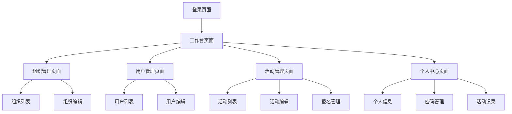

# 党建管理系统产品需求文档

## 1. Product Overview
党建管理系统是一个现代化的党建组织管理平台，旨在提高党建工作的数字化管理水平。系统通过数字化手段实现组织架构管理、党员信息管理、活动组织等核心功能，解决传统党建工作中信息分散、管理效率低下的问题。
- 主要解决党建工作中组织管理复杂、活动组织困难、信息统计繁琐等问题，为党务工作者和党员提供便捷的数字化管理工具。
- 目标是构建一个完整的党建工作数字化生态，提升党建工作效率和管理水平。

## 2. Core Features

### 2.1 User Roles
| Role | Registration Method | Core Permissions |
|------|---------------------|------------------|
| 系统管理员 | 系统预设账号 | 全系统管理权限，用户管理、组织管理、系统配置 |
| 组织管理员 | 上级管理员创建 | 所属组织及下级组织管理，活动管理，成员管理 |
| 普通党员 | 组织管理员创建 | 查看组织信息，参与活动，个人信息管理 |

### 2.2 Feature Module
我们的党建管理系统包含以下主要页面：
1. **登录页面**: 用户认证，角色验证，安全登录
2. **工作台页面**: 数据统计展示，快捷操作入口，通知公告
3. **组织管理页面**: 组织架构管理，组织信息维护，层级关系管理
4. **用户管理页面**: 党员信息管理，权限分配，账号状态管理
5. **活动管理页面**: 活动创建发布，报名管理，签到统计
6. **个人中心页面**: 个人信息维护，密码修改，参与活动记录

### 2.3 Page Details
| Page Name | Module Name | Feature description |
|-----------|-------------|---------------------|
| 登录页面 | 用户认证 | 用户名密码登录，JWT token生成，登录状态保持，错误提示 |
| 工作台页面 | 数据统计 | 组织数量统计，用户数量统计，活动数量统计，图表展示 |
| 工作台页面 | 快捷操作 | 常用功能快速入口，最近活动展示，待办事项提醒 |
| 组织管理页面 | 组织列表 | 分页查询组织，搜索过滤，组织类型筛选，状态管理 |
| 组织管理页面 | 组织编辑 | 创建新组织，编辑组织信息，设置上下级关系，激活停用 |
| 组织管理页面 | 组织树形 | 树形结构展示，层级关系可视化，拖拽调整结构 |
| 用户管理页面 | 用户列表 | 分页查询用户，按组织筛选，角色筛选，状态管理 |
| 用户管理页面 | 用户编辑 | 创建用户账号，编辑用户信息，分配角色权限，重置密码 |
| 活动管理页面 | 活动列表 | 分页查询活动，按时间筛选，按状态筛选，活动统计 |
| 活动管理页面 | 活动编辑 | 创建活动，编辑活动信息，设置报名规则，发布活动 |
| 活动管理页面 | 报名管理 | 查看报名列表，审核报名，签到管理，参与统计 |
| 个人中心页面 | 个人信息 | 查看个人资料，修改基本信息，上传头像 |
| 个人中心页面 | 密码管理 | 修改登录密码，密码强度验证，安全提示 |
| 个人中心页面 | 活动记录 | 查看参与活动历史，活动签到记录，活动评价 |

## 3. Core Process

**系统管理员流程：**
系统管理员登录后进入工作台，可以查看全系统统计数据。通过组织管理创建和维护组织架构，设置组织层级关系。通过用户管理创建组织管理员账号，分配相应权限。监控系统运行状态，处理异常情况。

**组织管理员流程：**
组织管理员登录后查看所属组织的数据统计。创建和管理下级组织，维护组织信息。创建普通党员账号，管理组织成员。创建和发布党建活动，管理活动报名和签到。查看活动统计报告。

**普通党员流程：**
普通党员登录后查看个人工作台，浏览可参与的活动。报名参加感兴趣的活动，参与活动签到。在个人中心查看参与记录，维护个人信息。

## 4. User Interface Design

### 4.1 Design Style
- **主色调**: #409EFF (Element Plus 蓝色)，辅助色 #67C23A (绿色)
- **按钮样式**: 圆角按钮，悬停效果，主要按钮使用主色调
- **字体**: 系统默认字体，标题 16px-20px，正文 14px，辅助文字 12px
- **布局风格**: 左侧导航 + 顶部面包屑，卡片式内容展示，表格列表布局
- **图标风格**: Element Plus 图标库，线性图标风格，统一视觉语言

### 4.2 Page Design Overview
| Page Name | Module Name | UI Elements |
|-----------|-------------|-------------|
| 登录页面 | 登录表单 | 居中卡片布局，蓝色主题，表单验证提示，登录按钮动效 |
| 工作台页面 | 统计卡片 | 网格布局，数据卡片，图表组件，渐变背景色 |
| 组织管理页面 | 组织列表 | 表格布局，搜索框，筛选器，操作按钮组，分页组件 |
| 组织管理页面 | 组织树形 | 树形组件，展开折叠，节点图标，连接线样式 |
| 用户管理页面 | 用户列表 | 表格布局，头像展示，状态标签，操作下拉菜单 |
| 活动管理页面 | 活动卡片 | 卡片网格布局，活动封面，时间标签，状态徽章 |
| 个人中心页面 | 信息表单 | 表单布局，头像上传，输入框样式，保存按钮 |

### 4.3 Responsiveness
系统采用桌面优先设计，支持平板和移动端自适应。在移动端，左侧导航收缩为抽屉式菜单，表格转换为卡片列表，支持触摸操作和手势交互。