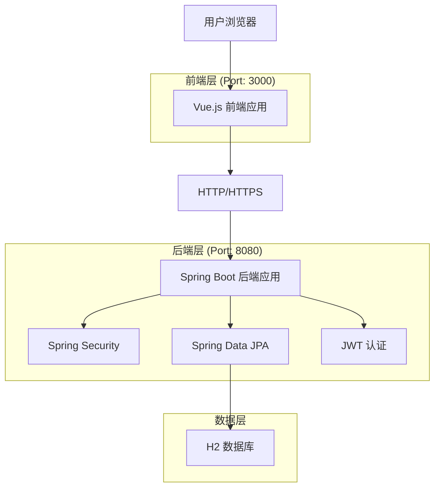
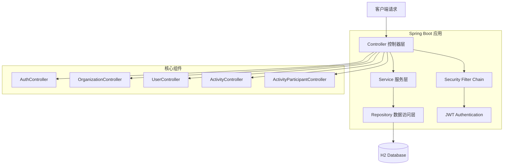
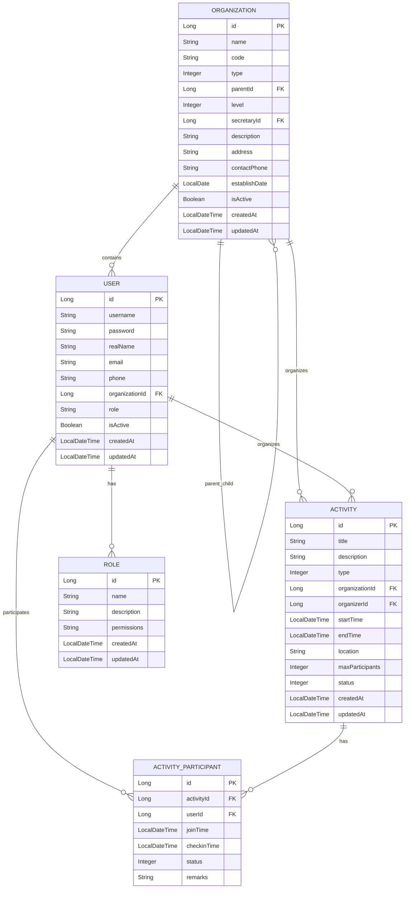

# 党建管理系统技术架构文档

## 1. Architecture design



## 2. Technology Description

* Frontend: Vue.js\@3 + Element Plus + Vite + Pinia + Vue Router

* Backend: Spring Boot\@2.7.14 + Spring Security + Spring Data JPA + JWT

* Database: H2 Database (内存数据库)

* Build Tools: Maven (后端) + Vite (前端)

* API Documentation: OpenAPI 3.0 (Swagger)

## 3. Route definitions

| Route                  | Purpose         |
| ---------------------- | --------------- |
| /login                 | 登录页面，用户身份认证     |
| /dashboard             | 工作台页面，数据统计和快捷操作 |
| /organization          | 组织管理页面，组织架构管理   |
| /organization/list     | 组织列表，分页查询和管理    |
| /organization/tree     | 组织树形结构展示        |
| /user                  | 用户管理页面，党员信息管理   |
| /user/list             | 用户列表，用户查询和管理    |
| /activity              | 活动管理页面，党建活动管理   |
| /activity/list         | 活动列表，活动查询和管理    |
| /activity/participants | 活动参与者管理         |
| /profile               | 个人中心，个人信息和设置    |
| /profile/info          | 个人信息维护          |
| /profile/password      | 密码修改            |

## 4. API definitions

### 4.1 Core API

**用户认证相关**

```
POST /api/auth/login
```

Request:

| Param Name | Param Type | isRequired | Description |
| ---------- | ---------- | ---------- | ----------- |
| username   | string     | true       | 用户名         |
| password   | string     | true       | 密码          |

Response:

| Param Name | Param Type | Description |
| ---------- | ---------- | ----------- |
| token      | string     | JWT访问令牌     |
| user       | object     | 用户信息对象      |

Example:

```json
{
  "username": "admin",
  "password": "123456"
}
```

**组织管理相关**

```
GET /api/organizations
POST /api/organizations
GET /api/organizations/{id}
PUT /api/organizations/{id}
DELETE /api/organizations/{id}
GET /api/organizations/tree
```

**用户管理相关**

```
GET /api/users
POST /api/users
GET /api/users/{id}
PUT /api/users/{id}
DELETE /api/users/{id}
```

**活动管理相关**

```
GET /api/activities
POST /api/activities
GET /api/activities/{id}
PUT /api/activities/{id}
DELETE /api/activities/{id}
POST /api/activities/{id}/join
GET /api/activities/{id}/participants
```

## 5. Server architecture diagram



## 6. Data model

### 6.1 Data model definition



### 6.2 Data Definition Language

**组织表 (organizations)**

```sql
-- 创建组织表
CREATE TABLE organizations (
    id BIGINT PRIMARY KEY AUTO_INCREMENT,
    name VARCHAR(100) NOT NULL,
    code VARCHAR(50) UNIQUE NOT NULL,
    type INTEGER NOT NULL CHECK (type IN (1, 2, 3)), -- 1:党委, 2:党总支, 3:党支部
    parent_id BIGINT,
    level INTEGER DEFAULT 1,
    secretary_id BIGINT,
    description TEXT,
    address VARCHAR(200),
    contact_phone VARCHAR(20),
    establish_date DATE,
    is_active BOOLEAN DEFAULT TRUE,
    created_at TIMESTAMP DEFAULT CURRENT_TIMESTAMP,
    updated_at TIMESTAMP DEFAULT CURRENT_TIMESTAMP ON UPDATE CURRENT_TIMESTAMP
);

-- 创建索引
CREATE INDEX idx_organizations_parent_id ON organizations(parent_id);
CREATE INDEX idx_organizations_type ON organizations(type);
CREATE INDEX idx_organizations_code ON organizations(code);
```

**用户表 (users)**

```sql
-- 创建用户表
CREATE TABLE users (
    id BIGINT PRIMARY KEY AUTO_INCREMENT,
    username VARCHAR(50) UNIQUE NOT NULL,
    password VARCHAR(255) NOT NULL,
    real_name VARCHAR(50) NOT NULL,
    email VARCHAR(100),
    phone VARCHAR(20),
    organization_id BIGINT,
    role VARCHAR(20) DEFAULT 'USER',
    is_active BOOLEAN DEFAULT TRUE,
    created_at TIMESTAMP DEFAULT CURRENT_TIMESTAMP,
    updated_at TIMESTAMP DEFAULT CURRENT_TIMESTAMP ON UPDATE CURRENT_TIMESTAMP,
    FOREIGN KEY (organization_id) REFERENCES organizations(id)
);

-- 创建索引
CREATE INDEX idx_users_username ON users(username);
CREATE INDEX idx_users_organization_id ON users(organization_id);
CREATE INDEX idx_users_role ON users(role);
```

**活动表 (activities)**

```sql
-- 创建活动表
CREATE TABLE activities (
    id BIGINT PRIMARY KEY AUTO_INCREMENT,
    title VARCHAR(200) NOT NULL,
    description TEXT,
    type INTEGER NOT NULL,
    organization_id BIGINT NOT NULL,
    organizer_id BIGINT NOT NULL,
    start_time TIMESTAMP NOT NULL,
    end_time TIMESTAMP NOT NULL,
    location VARCHAR(200),
    max_participants INTEGER,
    status INTEGER DEFAULT 1, -- 1:待开始, 2:进行中, 3:已结束, 4:已取消
    created_at TIMESTAMP DEFAULT CURRENT_TIMESTAMP,
    updated_at TIMESTAMP DEFAULT CURRENT_TIMESTAMP ON UPDATE CURRENT_TIMESTAMP,
    FOREIGN KEY (organization_id) REFERENCES organizations(id),
    FOREIGN KEY (organizer_id) REFERENCES users(id)
);

-- 创建索引
CREATE INDEX idx_activities_organization_id ON activities(organization_id);
CREATE INDEX idx_activities_organizer_id ON activities(organizer_id);
CREATE INDEX idx_activities_start_time ON activities(start_time);
CREATE INDEX idx_activities_status ON activities(status);
```

**活动参与者表 (activity\_participants)**

```sql
-- 创建活动参与者表
CREATE TABLE activity_participants (
    id BIGINT PRIMARY KEY AUTO_INCREMENT,
    activity_id BIGINT NOT NULL,
    user_id BIGINT NOT NULL,
    join_time TIMESTAMP DEFAULT CURRENT_TIMESTAMP,
    checkin_time TIMESTAMP,
    status INTEGER DEFAULT 1, -- 1:已报名, 2:已签到, 3:已取消
    remarks VARCHAR(500),
    FOREIGN KEY (activity_id) REFERENCES activities(id),
    FOREIGN KEY (user_id) REFERENCES users(id),
    UNIQUE KEY uk_activity_user (activity_id, user_id)
);

-- 创建索引
CREATE INDEX idx_activity_participants_activity_id ON activity_participants(activity_id);
CREATE INDEX idx_activity_participants_user_id ON activity_participants(user_id);
CREATE INDEX idx_activity_participants_status ON activity_participants(status);
```

**初始化数据**

```sql
-- 初始化根组织
INSERT INTO organizations (name, code, type, level, description, is_active) 
VALUES ('党委', 'ROOT', 1, 1, '根级党组织', TRUE);

-- 初始化管理员用户
INSERT INTO users (username, password, real_name, organization_id, role, is_active)
VALUES ('admin', '$2a$10$N.zmdr9k7uOCQb376NoUnuTJ8iAt6Z5EHsM8lE9lBOsl7iKTVEFDa', '系统管理员', 1, 'ADMIN', TRUE);
```

