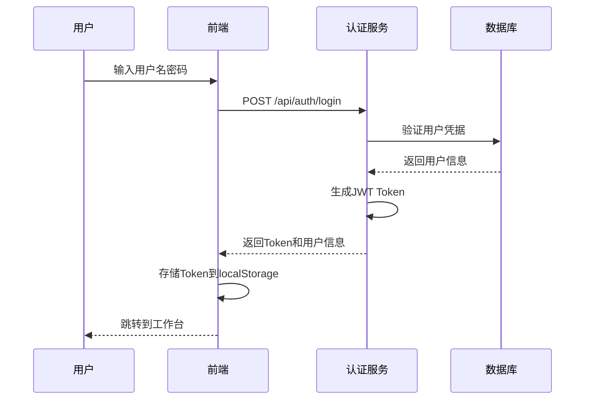
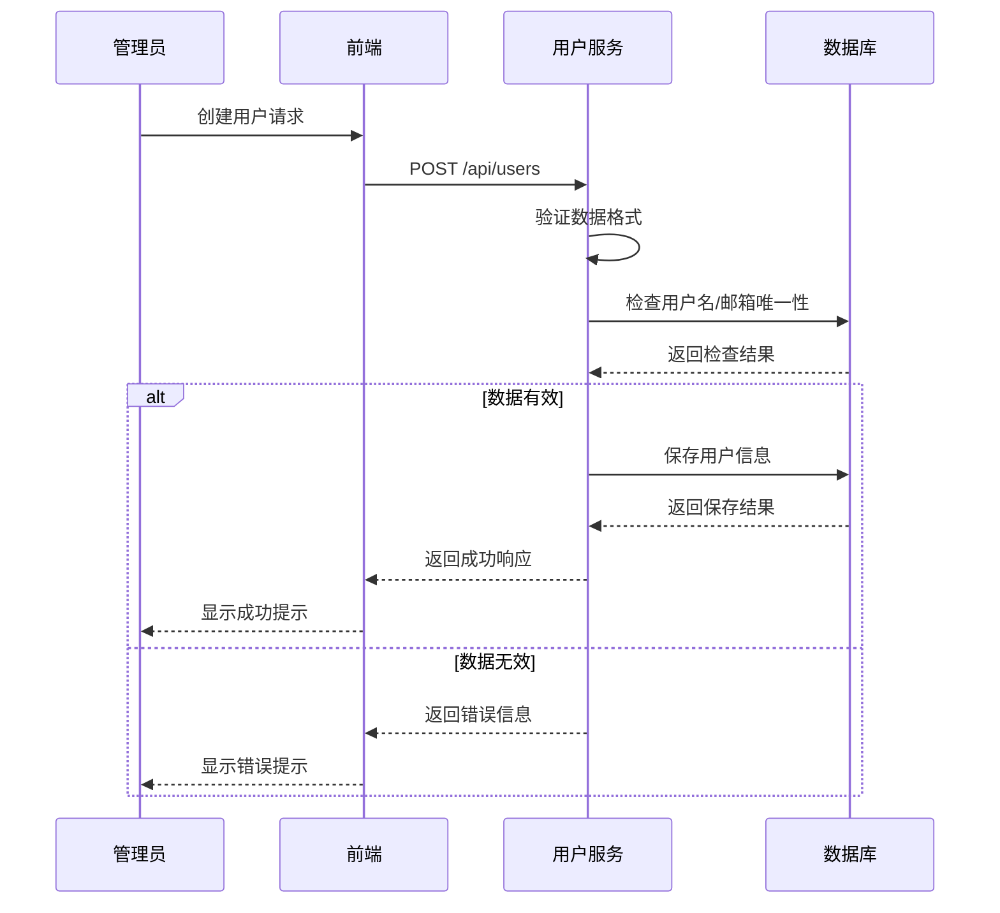
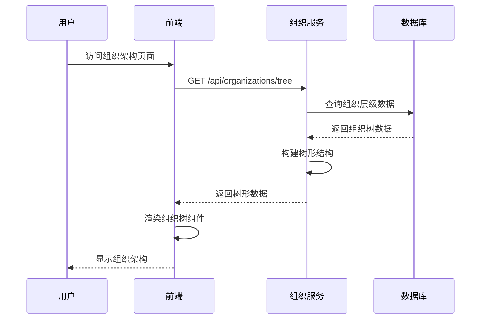
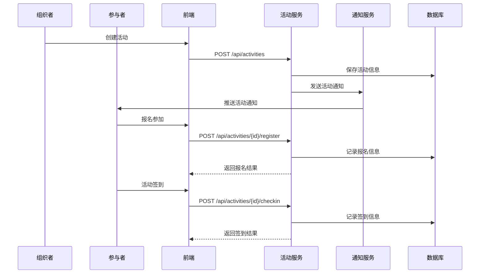
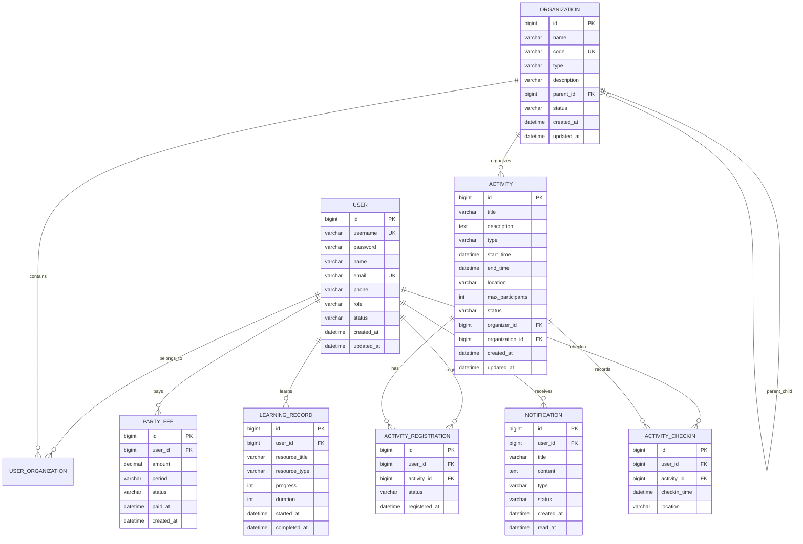

# 党建管理系统设计文档

## 1. 系统架构设计

### 1.1 整体架构

```mermaid
CREATE TABLE users (
    id BIGINT PRIMARY KEY AUTO_INCREMENT,
    username VARCHAR(50) UNIQUE NOT NULL,
    password VARCHAR(255) NOT NULL,
    name VARCHAR(100) NOT NULL,
    email VARCHAR(100) UNIQUE,
    phone VARCHAR(20),
    role VARCHAR(20) DEFAULT 'MEMBER',
    status VARCHAR(20) DEFAULT 'ACTIVE',
    created_at TIMESTAMP DEFAULT CURRENT_TIMESTAMP,
    updated_at TIMESTAMP DEFAULT CURRENT_TIMESTAMP ON UPDATE CURRENT_TIMESTAMP
);

CREATE INDEX idx_users_username ON users(username);
CREATE INDEX idx_users_email ON users(email);
CREATE INDEX idx_users_role ON users(role);
```

### 1.2 技术栈

**前端技术栈**:

* Vue.js 3.x - 渐进式JavaScript框架

* Vite - 构建工具

* Element Plus - UI组件库

* Pinia - 状态管理

* Vue Router - 路由管理

* Axios - HTTP客户端

**后端技术栈**:

* Spring Boot 2.7.14 - 应用框架

* Spring Security - 安全框架

* Spring Data JPA - 数据访问

* JWT - 身份认证

* H2 Database - 开发环境数据库

* MySQL - 生产环境数据库

* Redis - 缓存

* Maven - 构建工具

## 2. 系统模块设计

### 2.1 认证授权模块



### 2.2 用户管理模块



### 2.3 组织架构模块



### 2.4 活动管理模块



## 3. 数据库设计

### 3.1 核心实体关系图



### 3.2 数据库表结构

#### 用户表 (users)

```sql
CREATE TABLE users (
    id BIGINT PRIMARY KEY AUTO_INCREMENT,
    username VARCHAR(50) UNIQUE NOT NULL,
    password VARCHAR(255) NOT NULL,
    name VARCHAR(100) NOT NULL,
    email VARCHAR(100) UNIQUE,
    phone VARCHAR(20),
    role VARCHAR(20) DEFAULT 'MEMBER',
    status VARCHAR(20) DEFAULT 'ACTIVE',
    created_at TIMESTAMP DEFAULT CURRENT_TIMESTAMP,
    updated_at TIMESTAMP DEFAULT CURRENT_TIMESTAMP ON UPDATE CURRENT_TIMESTAMP
);

CREATE INDEX idx_users_username ON users(username);
CREATE INDEX idx_users_email ON users(email);
CREATE INDEX idx_users_role ON users(role);
```

#### 组织表 (organizations)

```sql
CREATE TABLE organizations (
    id BIGINT PRIMARY KEY AUTO_INCREMENT,
    name VARCHAR(100) NOT NULL,
    code VARCHAR(50) UNIQUE NOT NULL,
    type VARCHAR(20) NOT NULL,
    description TEXT,
    parent_id BIGINT,
    status VARCHAR(20) DEFAULT 'ACTIVE',
    created_at TIMESTAMP DEFAULT CURRENT_TIMESTAMP,
    updated_at TIMESTAMP DEFAULT CURRENT_TIMESTAMP ON UPDATE CURRENT_TIMESTAMP,
    FOREIGN KEY (parent_id) REFERENCES organizations(id)
);

CREATE INDEX idx_organizations_parent_id ON organizations(parent_id);
CREATE INDEX idx_organizations_type ON organizations(type);
```

#### 活动表 (activities)

```sql
CREATE TABLE activities (
    id BIGINT PRIMARY KEY AUTO_INCREMENT,
    title VARCHAR(200) NOT NULL,
    description TEXT,
    type VARCHAR(50) NOT NULL,
    start_time TIMESTAMP NOT NULL,
    end_time TIMESTAMP NOT NULL,
    location VARCHAR(200),
    max_participants INT DEFAULT 0,
    status VARCHAR(20) DEFAULT 'PLANNING',
    organizer_id BIGINT NOT NULL,
    organization_id BIGINT NOT NULL,
    created_at TIMESTAMP DEFAULT CURRENT_TIMESTAMP,
    updated_at TIMESTAMP DEFAULT CURRENT_TIMESTAMP ON UPDATE CURRENT_TIMESTAMP,
    FOREIGN KEY (organizer_id) REFERENCES users(id),
    FOREIGN KEY (organization_id) REFERENCES organizations(id)
);

CREATE INDEX idx_activities_start_time ON activities(start_time);
CREATE INDEX idx_activities_organizer_id ON activities(organizer_id);
CREATE INDEX idx_activities_organization_id ON activities(organization_id);
```

## 4. API接口设计

### 4.1 认证接口

#### 用户登录

```
POST /api/auth/login
```

**请求参数**:

| 参数名      | 类型     | 必填 | 描述  |
| -------- | ------ | -- | --- |
| username | string | 是  | 用户名 |
| password | string | 是  | 密码  |

**响应示例**:

```json
{
  "code": 200,
  "message": "登录成功",
  "data": {
    "token": "eyJhbGciOiJIUzI1NiIsInR5cCI6IkpXVCJ9...",
    "user": {
      "id": 1,
      "username": "admin",
      "name": "管理员",
      "role": "ADMIN"
    }
  }
}
```

### 4.2 用户管理接口

#### 获取用户列表

```
GET /api/users
```

**查询参数**:

| 参数名            | 类型     | 必填 | 描述        |
| -------------- | ------ | -- | --------- |
| page           | int    | 否  | 页码，默认1    |
| size           | int    | 否  | 每页大小，默认10 |
| keyword        | string | 否  | 搜索关键词     |
| organizationId | long   | 否  | 组织ID      |
| role           | string | 否  | 角色筛选      |

#### 创建用户

```
POST /api/users
```

**请求参数**:

```json
CREATE TABLE users (
    id BIGINT PRIMARY KEY AUTO_INCREMENT,
    username VARCHAR(50) UNIQUE NOT NULL,
    password VARCHAR(255) NOT NULL,
    name VARCHAR(100) NOT NULL,
    email VARCHAR(100) UNIQUE,
    phone VARCHAR(20),
    role VARCHAR(20) DEFAULT 'MEMBER',
    status VARCHAR(20) DEFAULT 'ACTIVE',
    created_at TIMESTAMP DEFAULT CURRENT_TIMESTAMP,
    updated_at TIMESTAMP DEFAULT CURRENT_TIMESTAMP ON UPDATE CURRENT_TIMESTAMP
);

CREATE INDEX idx_users_username ON users(username);
CREATE INDEX idx_users_email ON users(email);
CREATE INDEX idx_users_role ON users(role);
```

### 4.3 组织管理接口

#### 获取组织树

```
GET /api/organizations/tree
```

**响应示例**:

```json
{
  "code": 200,
  "data": [
    {
      "id": 1,
      "name": "党委",
      "code": "PC001",
      "type": "PARTY_COMMITTEE",
      "children": [
        {
          "id": 2,
          "name": "第一党支部",
          "code": "PB001",
          "type": "PARTY_BRANCH",
          "children": []
        }
      ]
    }
  ]
}
```

### 4.4 活动管理接口

#### 创建活动

```
POST /api/activities
```

**请求参数**:

```json
{
  "title": "主题党日活动",
  "description": "学习党的二十大精神",
  "type": "THEME_PARTY_DAY",
  "startTime": "2024-01-15T09:00:00",
  "endTime": "2024-01-15T11:00:00",
  "location": "会议室A",
  "maxParticipants": 50,
  "organizationId": 2
}
```

#### 活动报名

```
POST /api/activities/{id}/register
```

#### 活动签到

```
POST /api/activities/{id}/checkin
```

## 5. 安全设计

### 5.1 认证机制

* 使用JWT Token进行身份认证

* Token有效期24小时，支持刷新

* 密码使用BCrypt加密存储

### 5.2 权限控制

* 基于角色的访问控制(RBAC)

* 方法级权限注解

* 前端路由权限守卫

### 5.3 数据安全

* 敏感数据加密存储

* SQL注入防护

* XSS攻击防护

* CSRF攻击防护

## 6. 性能优化

### 6.1 缓存策略

* Redis缓存用户会话信息

* 缓存组织架构数据

* 缓存热点查询结果

### 6.2 数据库优化

* 合理设计索引

* 分页查询优化

* 连接池配置优化

### 6.3 前端优化

* 组件懒加载

* 图片懒加载

* 打包优化

* CDN加速

## 7. 部署架构

### 7.1 开发环境

* 前端: Vite开发服务器

* 后端: Spring Boot内嵌Tomcat

* 数据库: H2内存数据库

* 缓存: 内存缓存

### 7.2 生产环境

* 前端: Nginx静态文件服务

* 后端: Docker容器部署

* 数据库: MySQL主从复制

* 缓存: Redis集群

* 负载均衡: Nginx

## 8. 监控和日志

### 8.1 应用监控

* Spring Boot Actuator健康检查

* 性能指标监控

* 错误率监控

### 8.2 日志管理

* 结构化日志输出

* 日志级别配置

* 日志文件轮转

* 操作审计日志

***

**文档版本**: 1.0\
**创建日期**: 2024年\
**最后更新**: 2024年\
**文档状态**: 设计阶段
