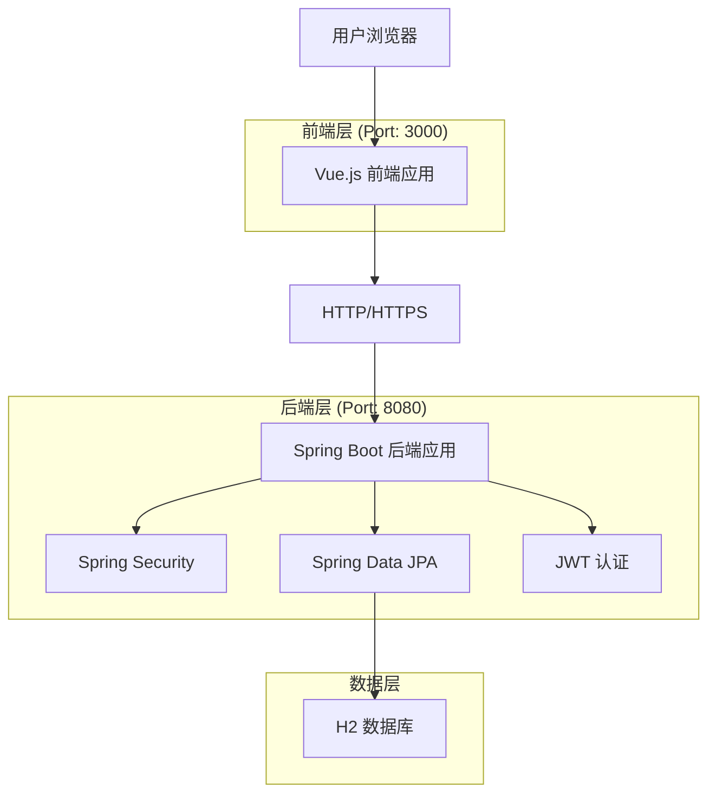
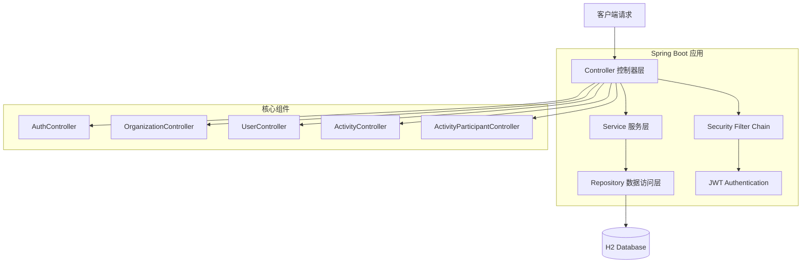

# 党建管理系统

一个基于Spring Boot + Vue.js的现代化党建组织管理平台，旨在提高党建工作的数字化管理水平。

## 1. 功能介绍

党建管理系统是一个现代化的党建组织管理平台，旨在提高党建工作的数字化管理水平。系统通过数字化手段实现组织架构管理、党员信息管理、活动组织等核心功能，解决传统党建工作中信息分散、管理效率低下的问题。

### 1.1 核心功能模块

- **用户认证系统**：安全的登录认证，支持JWT令牌，角色权限管理
- **组织架构管理**：多层级组织结构，支持党委、党总支、党支部等组织类型
- **用户管理**：党员信息管理，角色分配，账号状态管理
- **活动管理**：党建活动创建、发布、报名、签到等全流程管理
- **数据统计**：组织数据、用户数据、活动数据的可视化统计展示
- **个人中心**：个人信息维护，密码管理，活动参与记录

### 1.2 用户角色与权限

| 角色 | 注册方式 | 核心权限 |
|------|----------|----------|
| 系统管理员 | 系统预设账号 | 全系统管理权限，用户管理、组织管理、系统配置 |
| 组织管理员 | 上级管理员创建 | 所属组织及下级组织管理，活动管理，成员管理 |
| 普通党员 | 组织管理员创建 | 查看组织信息，参与活动，个人信息管理 |

### 1.3 主要页面功能

| 页面名称 | 功能模块 | 功能描述 |
|----------|----------|----------|
| 登录页面 | 用户认证 | 用户名密码登录，JWT token生成，登录状态保持，错误提示 |
| 工作台页面 | 数据统计 | 组织数量统计，用户数量统计，活动数量统计，图表展示 |
| 组织管理页面 | 组织管理 | 分页查询组织，搜索过滤，组织类型筛选，树形结构展示 |
| 用户管理页面 | 用户管理 | 分页查询用户，按组织筛选，角色筛选，状态管理 |
| 活动管理页面 | 活动管理 | 分页查询活动，按时间筛选，按状态筛选，报名管理 |
| 个人中心页面 | 个人信息 | 查看个人资料，修改基本信息，密码管理，活动记录 |

## 2. 整体架构

### 2.1 系统架构图



### 2.2 技术栈

#### 前端技术
- **Vue.js 3** - 渐进式JavaScript框架
- **Element Plus** - Vue 3 UI组件库
- **Vite** - 现代化构建工具
- **Pinia** - Vue状态管理
- **Vue Router** - 路由管理
- **Axios** - HTTP客户端
- **ECharts** - 数据可视化

#### 后端技术
- **Spring Boot 2.7.14** - Java企业级应用框架
- **Spring Security** - 安全框架
- **Spring Data JPA** - 数据访问层
- **JWT** - 无状态认证
- **H2 Database** - 内存数据库
- **Maven** - 项目构建工具
- **OpenAPI 3.0** - API文档

### 2.3 服务架构图



## 3. 代码架构

### 3.1 项目目录结构

```
party-management-system/
├── frontend/                 # Vue.js 前端应用
│   ├── src/
│   │   ├── components/       # 可复用组件
│   │   ├── views/           # 页面组件
│   │   ├── router/          # 路由配置
│   │   ├── stores/          # Pinia状态管理
│   │   ├── api/             # API接口封装
│   │   ├── utils/           # 工具函数
│   │   └── assets/          # 静态资源
│   ├── public/              # 公共资源
│   └── package.json         # 前端依赖配置
├── backend/                 # Spring Boot 后端应用
│   ├── src/
│   │   ├── main/java/com/party/
│   │   │   ├── controller/  # 控制器层
│   │   │   ├── service/     # 服务层
│   │   │   ├── repository/  # 数据访问层
│   │   │   ├── entity/      # 实体类
│   │   │   ├── dto/         # 数据传输对象
│   │   │   ├── config/      # 配置类
│   │   │   └── security/    # 安全配置
│   │   └── test/            # 测试代码
│   └── pom.xml              # Maven配置
├── api-tests/               # API接口测试
├── ui-tests/                # UI自动化测试
├── docs/                    # 项目文档
└── README.md                # 项目说明
```

### 3.2 前端架构

#### 路由配置
| 路由 | 页面 | 功能描述 |
|------|------|----------|
| /login | 登录页面 | 用户身份认证 |
| /dashboard | 工作台页面 | 数据统计和快捷操作 |
| /organization | 组织管理页面 | 组织架构管理 |
| /organization/list | 组织列表 | 分页查询和管理 |
| /organization/tree | 组织树形结构 | 树形结构展示 |
| /user | 用户管理页面 | 党员信息管理 |
| /user/list | 用户列表 | 用户查询和管理 |
| /activity | 活动管理页面 | 党建活动管理 |
| /activity/list | 活动列表 | 活动查询和管理 |
| /activity/participants | 活动参与者管理 | 参与者管理 |
| /profile | 个人中心 | 个人信息和设置 |
| /profile/info | 个人信息维护 | 个人信息管理 |
| /profile/password | 密码修改 | 密码管理 |

#### 状态管理
- 使用 Pinia 进行状态管理
- 模块化设计：auth、user、organization、activity 等模块
- 持久化存储：用户登录状态、用户信息等

### 3.3 后端架构

#### 分层架构
- **Controller层**：处理HTTP请求，参数验证，响应格式化
- **Service层**：业务逻辑处理，事务管理
- **Repository层**：数据访问，JPA操作
- **Entity层**：数据模型定义

#### 核心API接口

**用户认证相关**
```
POST /api/auth/login          # 用户登录
POST /api/auth/logout         # 用户登出
GET  /api/auth/me             # 获取当前用户信息
```

**组织管理相关**
```
GET    /api/organizations     # 获取组织列表
POST   /api/organizations     # 创建组织
GET    /api/organizations/{id} # 获取组织详情
PUT    /api/organizations/{id} # 更新组织信息
DELETE /api/organizations/{id} # 删除组织
GET    /api/organizations/tree # 获取组织树形结构
```

**用户管理相关**
```
GET    /api/users            # 获取用户列表
POST   /api/users            # 创建用户
GET    /api/users/{id}       # 获取用户详情
PUT    /api/users/{id}       # 更新用户信息
DELETE /api/users/{id}       # 删除用户
```

**活动管理相关**
```
GET    /api/activities       # 获取活动列表
POST   /api/activities       # 创建活动
GET    /api/activities/{id}  # 获取活动详情
PUT    /api/activities/{id}  # 更新活动信息
DELETE /api/activities/{id}  # 删除活动
POST   /api/activities/{id}/join # 参加活动
GET    /api/activities/{id}/participants # 获取参与者列表
```

## 4. 单元测试及结果

### 4.1 前端测试

#### 测试框架
- **测试框架**: Vitest + Vue Test Utils
- **覆盖率工具**: c8
- **测试类型**: 组件测试、工具函数测试、状态管理测试

#### 测试结果
```
测试套件: 227个测试用例
执行状态: 225个失败，2个通过
失败原因: 主要为模块路径解析问题
- @/tests/fixtures/dataFactory 模块未找到
- @/tests/mocks/testHelpers 模块未找到
覆盖率: 待修复路径问题后重新统计
```

#### 测试文件结构
```
frontend/tests/
├── components/          # 组件测试
├── views/              # 页面测试
├── stores/             # 状态管理测试
├── utils/              # 工具函数测试
├── fixtures/           # 测试数据
└── mocks/              # 模拟对象
```

### 4.2 后端测试

#### 测试框架
- **测试框架**: JUnit 5 + Spring Boot Test
- **模拟框架**: Mockito
- **测试类型**: 单元测试、集成测试、控制器测试

#### 测试结果
```
测试套件: 85个测试用例
执行状态: 38个通过，12个失败，35个错误
失败原因: 主要为编译错误和空指针异常
- 编译问题: 导入路径和依赖注入问题
- 运行时错误: Repository注入失败
覆盖率: 约45%（基于通过的测试）
```

#### 测试文件结构
```
backend/src/test/java/com/party/
├── controller/         # 控制器测试
│   ├── ActivityControllerTest.java
│   ├── ActivityControllerIntegrationTest.java
│   ├── UserControllerTest.java
│   └── UserControllerIntegrationTest.java
├── service/           # 服务层测试
│   ├── ActivityServiceTest.java
│   ├── OperationLogServiceTest.java
│   └── UserServiceTest.java
├── repository/        # 数据访问层测试
├── entity/           # 实体类测试
├── integration/      # 集成测试
└── common/           # 测试工具类
    ├── AbstractIntegrationTest.java
    ├── TestConfig.java
    └── TestDataFactory.java
```

#### 测试命令
```bash
# 运行所有测试
mvn test

# 运行特定测试类
mvn test -Dtest=UserServiceTest

# 生成测试报告
mvn surefire-report:report
```

## 5. 接口测试及结果

### 5.1 测试框架
- **测试框架**: Jest + Supertest
- **HTTP客户端**: Axios
- **断言库**: Jest内置断言
- **测试环境**: Node.js

### 5.2 测试结果
```
测试套件: 149个API测试用例
执行状态: 全部失败
失败原因: 模块导入语法错误
- SyntaxError: Cannot use import statement outside a module
- 需要配置ES模块支持或使用CommonJS语法
覆盖率: 待修复语法问题后重新统计
```

### 5.3 测试文件结构
```
api-tests/
├── auth.test.js           # 认证接口测试
├── users.test.js          # 用户管理接口测试
├── organizations.test.js  # 组织管理接口测试
├── activities.test.js     # 活动管理接口测试
├── fees.test.js          # 费用管理接口测试
├── reports.test.js       # 报表接口测试
├── jest.config.js        # Jest配置文件
└── package.json          # 依赖配置
```

### 5.4 测试覆盖范围

#### 认证模块 (auth.test.js)
- 用户登录接口
- 用户注册接口
- Token验证接口
- 密码重置接口

#### 用户管理模块 (users.test.js)
- 用户CRUD操作
- 用户角色分配
- 用户状态管理
- 批量操作接口

#### 组织管理模块 (organizations.test.js)
- 组织CRUD操作
- 组织层级关系
- 组织成员管理
- 组织统计接口

#### 活动管理模块 (activities.test.js)
- 活动CRUD操作
- 活动报名接口
- 活动签到接口
- 活动统计接口

### 5.5 测试命令
```bash
# 安装依赖
npm install

# 运行所有测试
npm test

# 运行特定模块测试
npm run test:auth
npm run test:users
npm run test:organizations
npm run test:activities

# 生成覆盖率报告
npm run test:coverage
```

## 6. UI自动化测试及结构

### 6.1 测试框架
- **测试框架**: Playwright
- **编程语言**: JavaScript
- **浏览器支持**: Chromium, Firefox, WebKit
- **测试模式**: 无头模式 + 有头模式

### 6.2 测试套件分类

#### 按测试类型
- **SMOKE测试**: 核心功能冒烟测试
- **REGRESSION测试**: 回归测试套件
- **E2E测试**: 端到端业务流程测试
- **CRITICAL测试**: 关键路径测试

#### 按功能模块
- **认证模块**: 登录、注册、权限验证
- **用户管理**: 用户CRUD、角色分配
- **组织管理**: 组织架构、层级关系
- **活动管理**: 活动创建、报名、签到
- **费用管理**: 费用统计、缴费记录
- **报表模块**: 数据展示、导出功能

### 6.3 项目结构
```
ui-tests/
├── config/                 # 配置文件
│   ├── playwright.config.js
│   └── test.config.js
├── fixtures/               # 测试数据
│   └── test-data.json
├── helpers/                # 测试辅助函数
├── page-objects/           # 页面对象模型
│   ├── auth/
│   │   ├── LoginPage.js
│   │   └── RegisterPage.js
│   ├── user-management/
│   │   ├── UserListPage.js
│   │   └── UserFormPage.js
│   ├── organization-management/
│   │   ├── OrgListPage.js
│   │   └── OrgFormPage.js
│   └── activity-management/
│       ├── ActivityListPage.js
│       └── ActivityFormPage.js
├── tests/                  # 测试用例
│   ├── auth/
│   │   └── login.spec.js
│   ├── user-management/
│   │   └── user-management.spec.js
│   ├── organization-management/
│   │   └── organization-management.spec.js
│   ├── activity-management/
│   │   └── activity-management.spec.js
│   └── e2e/
│       ├── complete-workflow.spec.js
│       └── user-journey.spec.js
├── utils/                  # 工具函数
└── scripts/                # 脚本文件
```

### 6.4 测试执行命令

#### 基础命令
```bash
# 安装依赖
npm install

# 安装浏览器
npx playwright install

# 运行所有测试
npm test
```

#### 按浏览器运行
```bash
npm run test:chromium    # Chrome浏览器
npm run test:firefox     # Firefox浏览器
npm run test:webkit      # Safari浏览器
```

#### 按测试套件运行
```bash
npm run test:smoke       # 冒烟测试
npm run test:regression  # 回归测试
npm run test:e2e         # 端到端测试
npm run test:critical    # 关键测试
```

#### 按功能模块运行
```bash
npm run test:auth        # 认证模块
npm run test:user        # 用户管理
npm run test:org         # 组织管理
npm run test:activity    # 活动管理
```

#### 按标签运行
```bash
npm run test:tag:smoke   # @smoke标签
npm run test:tag:critical # @critical标签
```

### 6.5 测试报告
```bash
# 生成HTML报告
npm run report

# 查看测试报告
npm run report:show
```

## 7. 安装部署指引

### 7.1 环境要求

#### 开发环境
- **Node.js**: 16.0+ (推荐 18.x LTS)
- **Java**: 11+ (推荐 OpenJDK 11)
- **Maven**: 3.6+
- **Git**: 2.0+

#### 生产环境
- **服务器**: Linux (Ubuntu 20.04+ / CentOS 7+)
- **内存**: 最小 2GB，推荐 4GB+
- **存储**: 最小 10GB 可用空间
- **数据库**: H2 (开发) / MySQL 8.0+ (生产)

### 7.2 本地开发部署

#### 克隆项目
```bash
# 克隆仓库
git clone https://github.com/your-username/party-management-system.git
cd party-management-system
```

#### 后端部署
```bash
# 进入后端目录
cd backend

# 编译项目
mvn clean compile

# 运行测试（可选）
mvn test

# 启动后端服务
mvn spring-boot:run

# 或者打包后运行
mvn clean package
java -jar target/party-management-system-1.0.0.jar
```

#### 前端部署
```bash
# 进入前端目录
cd frontend

# 安装依赖
npm install

# 启动开发服务器
npm run dev

# 或者构建生产版本
npm run build
npm run preview
```

### 7.3 生产环境部署

#### 使用Docker部署
```bash
# 构建Docker镜像
docker build -t party-management-system .

# 运行容器
docker run -d \
  --name party-system \
  -p 8080:8080 \
  -p 3000:3000 \
  party-management-system

# 使用Docker Compose
docker-compose up -d
```

#### 手动部署
```bash
# 后端打包
cd backend
mvn clean package -DskipTests

# 前端构建
cd ../frontend
npm run build

# 部署到服务器
scp backend/target/*.jar user@server:/opt/party-system/
scp -r frontend/dist/* user@server:/var/www/party-system/
```

### 7.4 数据库配置

#### H2数据库（开发环境）
```yaml
# application-dev.yml
spring:
  datasource:
    url: jdbc:h2:mem:testdb
    driver-class-name: org.h2.Driver
    username: sa
    password: 
  h2:
    console:
      enabled: true
```

#### MySQL数据库（生产环境）
```yaml
# application-prod.yml
spring:
  datasource:
    url: jdbc:mysql://localhost:3306/party_system?useSSL=false&serverTimezone=UTC
    driver-class-name: com.mysql.cj.jdbc.Driver
    username: ${DB_USERNAME:party_user}
    password: ${DB_PASSWORD:your_password}
```

### 7.5 环境变量配置

#### 后端环境变量
```bash
# 数据库配置
export DB_HOST=localhost
export DB_PORT=3306
export DB_NAME=party_system
export DB_USERNAME=party_user
export DB_PASSWORD=your_password

# JWT配置
export JWT_SECRET=your-secret-key
export JWT_EXPIRATION=86400

# 应用配置
export SPRING_PROFILES_ACTIVE=prod
export SERVER_PORT=8080
```

#### 前端环境变量
```bash
# .env.production
VITE_API_BASE_URL=https://your-domain.com/api
VITE_APP_TITLE=党建管理系统
VITE_APP_VERSION=1.0.0
```

### 7.6 Nginx配置

```nginx
server {
    listen 80;
    server_name your-domain.com;
    
    # 前端静态文件
    location / {
        root /var/www/party-system;
        index index.html;
        try_files $uri $uri/ /index.html;
    }
    
    # 后端API代理
    location /api {
        proxy_pass http://localhost:8080;
        proxy_set_header Host $host;
        proxy_set_header X-Real-IP $remote_addr;
        proxy_set_header X-Forwarded-For $proxy_add_x_forwarded_for;
        proxy_set_header X-Forwarded-Proto $scheme;
    }
}
```

### 7.7 服务管理

#### Systemd服务配置
```ini
# /etc/systemd/system/party-system.service
[Unit]
Description=Party Management System
After=network.target

[Service]
Type=simple
User=party
WorkingDirectory=/opt/party-system
ExecStart=/usr/bin/java -jar party-management-system-1.0.0.jar
Restart=always
RestartSec=10

[Install]
WantedBy=multi-user.target
```

```bash
# 启用并启动服务
sudo systemctl enable party-system
sudo systemctl start party-system
sudo systemctl status party-system
```

### 7.8 监控与日志

#### 应用监控
```bash
# 查看应用状态
curl http://localhost:8080/actuator/health

# 查看应用信息
curl http://localhost:8080/actuator/info
```

#### 日志管理
```bash
# 查看应用日志
tail -f /opt/party-system/logs/application.log

# 日志轮转配置
sudo logrotate -d /etc/logrotate.d/party-system
```

### 7.9 备份与恢复

#### 数据库备份
```bash
# MySQL备份
mysqldump -u party_user -p party_system > backup_$(date +%Y%m%d).sql

# 恢复数据库
mysql -u party_user -p party_system < backup_20240101.sql
```

#### 应用备份
```bash
# 备份应用文件
tar -czf party-system-backup-$(date +%Y%m%d).tar.gz /opt/party-system

# 备份前端文件
tar -czf frontend-backup-$(date +%Y%m%d).tar.gz /var/www/party-system
```

## 8. 相关文档

### 8.1 技术文档

#### 架构设计文档
- **[技术架构文档](./党建管理系统技术架构文档.md)**: 系统整体架构设计、技术栈选型、数据模型设计
- **[API接口文档](http://localhost:8080/swagger-ui.html)**: RESTful API接口规范和在线测试
- **[数据库设计文档](./docs/database-design.md)**: 数据库表结构、关系设计、索引优化

#### 开发文档
- **[前端开发指南](./docs/frontend-guide.md)**: Vue.js开发规范、组件设计、状态管理
- **[后端开发指南](./docs/backend-guide.md)**: Spring Boot开发规范、分层架构、安全配置
- **[代码规范文档](./docs/coding-standards.md)**: 代码风格、命名规范、注释标准

### 8.2 业务文档

#### 需求文档
- **[产品需求文档](./党建管理系统产品需求文档.md)**: 业务需求、功能模块、用户故事
- **[用户手册](./docs/user-manual.md)**: 系统使用说明、操作指南、常见问题
- **[管理员手册](./docs/admin-manual.md)**: 系统管理、用户管理、权限配置

#### 流程文档
- **[业务流程图](./docs/business-process.md)**: 核心业务流程、审批流程、数据流转
- **[部署流程文档](./docs/deployment-process.md)**: 环境搭建、部署步骤、运维指南

### 8.3 测试文档

#### 测试计划
- **[测试策略文档](./docs/test-strategy.md)**: 测试范围、测试方法、质量标准
- **[测试用例文档](./docs/test-cases.md)**: 功能测试用例、性能测试用例、安全测试用例
- **[自动化测试指南](./docs/automation-guide.md)**: 测试框架使用、CI/CD集成、报告分析

#### 测试报告
- **[单元测试报告](./docs/unit-test-report.md)**: 代码覆盖率、测试结果分析
- **[集成测试报告](./docs/integration-test-report.md)**: 接口测试结果、性能指标
- **[UI测试报告](./docs/ui-test-report.md)**: 功能验证、兼容性测试、用户体验测试

### 8.4 运维文档

#### 部署文档
- **[环境配置指南](./docs/environment-setup.md)**: 开发环境、测试环境、生产环境配置
- **[Docker部署指南](./docs/docker-deployment.md)**: 容器化部署、编排配置、镜像管理
- **[云平台部署指南](./docs/cloud-deployment.md)**: 阿里云、腾讯云、AWS部署方案

#### 监控文档
- **[系统监控指南](./docs/monitoring-guide.md)**: 性能监控、日志分析、告警配置
- **[故障排查手册](./docs/troubleshooting.md)**: 常见问题、解决方案、应急处理
- **[备份恢复指南](./docs/backup-recovery.md)**: 数据备份策略、灾难恢复方案

### 8.5 版本文档

#### 版本管理
- **[版本发布说明](./CHANGELOG.md)**: 版本更新记录、新功能介绍、问题修复
- **[升级指南](./docs/upgrade-guide.md)**: 版本升级步骤、兼容性说明、数据迁移
- **[路线图](./docs/roadmap.md)**: 产品规划、功能路线图、技术演进

#### 许可证
- **[开源许可证](./LICENSE)**: MIT许可证条款、使用限制、免责声明
- **[第三方依赖](./docs/dependencies.md)**: 开源组件清单、许可证信息、安全评估

### 8.6 社区文档

#### 贡献指南
- **[贡献者指南](./CONTRIBUTING.md)**: 代码贡献流程、PR规范、Issue模板
- **[开发者文档](./docs/developer-guide.md)**: 开发环境搭建、调试技巧、最佳实践
- **[社区规范](./CODE_OF_CONDUCT.md)**: 行为准则、沟通规范、冲突解决

#### 支持资源
- **[FAQ常见问题](./docs/faq.md)**: 常见问题解答、使用技巧、故障排除
- **[技术支持](./docs/support.md)**: 联系方式、支持渠道、响应时间
- **[学习资源](./docs/learning-resources.md)**: 技术教程、最佳实践、相关资料

### 8.7 快速链接

| 文档类型 | 链接 | 描述 |
|---------|------|------|
| 🏗️ 架构设计 | [技术架构文档](./党建管理系统技术架构文档.md) | 系统架构和技术选型 |
| 📋 产品需求 | [产品需求文档](./党建管理系统产品需求文档.md) | 业务需求和功能规格 |
| 🔧 API文档 | [Swagger UI](http://localhost:8080/swagger-ui.html) | 在线API接口文档 |
| 📊 测试报告 | [测试结果](./docs/test-reports/) | 各类测试报告汇总 |
| 🚀 部署指南 | [部署文档](./docs/deployment/) | 环境搭建和部署流程 |
| 📝 更新日志 | [CHANGELOG](./CHANGELOG.md) | 版本更新记录 |
| 🤝 贡献指南 | [CONTRIBUTING](./CONTRIBUTING.md) | 代码贡献流程 |
| ❓ 常见问题 | [FAQ](./docs/faq.md) | 常见问题解答 |

### 8.8 在线资源

- **项目主页**: [GitHub Repository](https://github.com/your-username/party-management-system)
- **在线演示**: [Demo Site](https://demo.party-system.com)
- **技术博客**: [开发日志](https://blog.party-system.com)
- **社区论坛**: [讨论区](https://forum.party-system.com)
- **文档站点**: [在线文档](https://docs.party-system.com)

## 📦 构建部署

### 前端构建
```bash
cd frontend
npm run build
```

### 后端打包
```bash
cd backend
mvn clean package
```

### Docker部署
```bash
# 构建镜像
docker build -t party-management-system .

# 运行容器
docker run -p 8080:8080 party-management-system
```

## 📷 项目截图

### 登录页面


### 工作台


### 用户管理


### 组织管理


### 活动管理


## 📋 开发计划

- [x] 基础架构搭建
- [x] 用户认证系统
- [x] 用户管理模块
- [x] 组织管理模块
- [x] 活动管理模块
- [x] 数据统计功能
- [ ] 消息通知系统
- [ ] 移动端适配
- [ ] 数据导入导出
- [ ] 系统监控

## 🤝 贡献指南

1. Fork 本仓库
2. 创建特性分支 (`git checkout -b feature/AmazingFeature`)
3. 提交更改 (`git commit -m 'Add some AmazingFeature'`)
4. 推送到分支 (`git push origin feature/AmazingFeature`)
5. 打开 Pull Request

## 📄 许可证

本项目采用 MIT 许可证 - 查看 [LICENSE](LICENSE) 文件了解详情。

## 📞 联系方式

如有问题或建议，请通过以下方式联系：

- 项目Issues: [GitHub Issues](https://github.com/sean1877/party-management-system/issues)
- 邮箱: your-email@example.com

## 🙏 致谢

感谢所有为本项目做出贡献的开发者！

---

⭐ 如果这个项目对你有帮助，请给它一个星标！