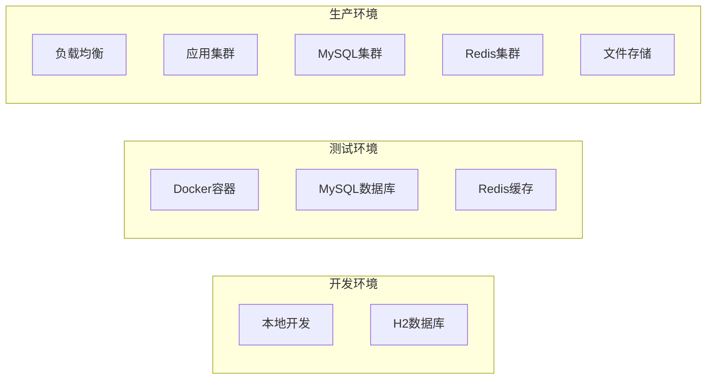

# 党建管理系统系统设计文档

## 1. 概述

### 1.1 设计目标
基于需求分析文档，设计一个完整的党建管理系统，实现党员管理、党费管理、活动管理等核心功能，确保系统具有良好的扩展性、可维护性和安全性。

### 1.2 设计原则
- **模块化设计**: 各功能模块独立，便于维护和扩展
- **安全性优先**: 完善的权限控制和数据安全机制
- **用户体验**: 界面友好，操作简单直观
- **性能优化**: 合理的数据库设计和缓存策略
- **可扩展性**: 支持未来功能扩展和业务变化

### 1.3 技术选型
基于现有项目结构，采用以下技术栈：

#### 1.3.1 后端技术栈
- **框架**: Spring Boot 2.7.14
- **安全**: Spring Security + JWT
- **数据访问**: Spring Data JPA + Hibernate
- **数据库**: H2（开发环境）→ MySQL/PostgreSQL（生产环境）
- **文档**: SpringDoc OpenAPI
- **缓存**: Spring Cache（可扩展为Redis）
- **消息队列**: 可扩展为RabbitMQ/RocketMQ

#### 1.3.2 前端技术栈
- **框架**: Vue 3.3.4
- **UI组件**: Element Plus 2.3.8
- **构建工具**: Vite 4.4.5
- **状态管理**: Pinia 2.1.6
- **路由**: Vue Router 4.2.4
- **图表**: ECharts 5.4.3 + Vue-ECharts 6.6.1
- **HTTP客户端**: Axios 1.4.0

## 2. 系统架构

### 2.1 整体架构
系统采用前后端分离的B/S架构，遵循RESTful API设计规范：


### 2.2 部署架构
支持多种部署方式：



## 3. 组件和接口

### 3.1 后端组件设计

#### 3.1.1 控制器层 (Controller)
- **UserController**: 用户管理相关接口
- **OrganizationController**: 组织管理相关接口
- **ActivityController**: 活动管理相关接口
- **ActivityParticipantController**: 活动参与管理接口
- **AuthController**: 认证授权接口
- **StatisticsController**: 统计分析接口

#### 3.1.2 服务层 (Service)
- **UserService**: 用户管理业务逻辑
- **OrganizationService**: 组织管理业务逻辑
- **ActivityService**: 活动管理业务逻辑
- **ActivityParticipantService**: 活动参与管理业务逻辑
- **StatisticsService**: 统计分析业务逻辑
- **AuthService**: 认证授权业务逻辑

#### 3.1.3 数据访问层 (Repository)
- **UserRepository**: 用户数据访问
- **OrganizationRepository**: 组织数据访问
- **ActivityRepository**: 活动数据访问
- **ActivityParticipantRepository**: 活动参与数据访问
- **RoleRepository**: 角色数据访问

#### 3.1.4 实体类 (Entity)
- **User**: 用户实体
- **Organization**: 组织实体
- **Activity**: 活动实体
- **ActivityParticipant**: 活动参与实体
- **Role**: 角色实体

### 3.2 前端组件设计

#### 3.2.1 页面组件 (Views)
- **Login**: 登录页面
- **Dashboard**: 仪表盘
- **UserManagement**: 用户管理
- **ActivityManagement**: 活动管理
- **OrganizationManagement**: 组织管理
- **Profile**: 个人资料

#### 3.2.2 业务组件 (Components)
- **UserForm**: 用户表单
- **ActivityForm**: 活动表单
- **OrganizationForm**: 组织表单
- **CheckInDialog**: 签到对话框
- **ParticipantList**: 参与者列表

#### 3.2.3 布局组件 (Layout)
- **Navbar**: 导航栏
- **Sidebar**: 侧边栏
- **SidebarItem**: 侧边栏项目

### 3.3 API接口设计

#### 3.3.1 用户管理API
```
GET /api/users - 获取用户列表
POST /api/users - 创建用户
GET /api/users/{id} - 获取用户详情
PUT /api/users/{id} - 更新用户
DELETE /api/users/{id} - 删除用户
GET /api/users/organization/{orgId} - 获取组织内用户
```

#### 3.3.2 活动管理API
```
GET /api/activities - 获取活动列表
POST /api/activities - 创建活动
GET /api/activities/{id} - 获取活动详情
PUT /api/activities/{id} - 更新活动
DELETE /api/activities/{id} - 删除活动
POST /api/activities/{id}/join - 报名活动
POST /api/activities/{id}/checkin - 活动签到
```

#### 3.3.3 组织管理API
```
GET /api/organizations - 获取组织列表
POST /api/organizations - 创建组织
GET /api/organizations/{id} - 获取组织详情
PUT /api/organizations/{id} - 更新组织
DELETE /api/organizations/{id} - 删除组织
GET /api/organizations/tree - 获取组织树
```

#### 3.3.4 统计分析API
```
GET /api/statistics/overview - 获取概览统计
GET /api/statistics/users - 用户统计
GET /api/statistics/activities - 活动统计
GET /api/statistics/organizations - 组织统计
```

## 4. 数据模型

### 4.1 数据库设计

#### 4.1.1 用户表 (users)
```sql
CREATE TABLE users (
    id BIGINT PRIMARY KEY AUTO_INCREMENT,
    username VARCHAR(50) UNIQUE NOT NULL,
    password VARCHAR(255) NOT NULL,
    real_name VARCHAR(50) NOT NULL,
    id_card VARCHAR(18),
    phone VARCHAR(11),
    email VARCHAR(100),
    gender TINYINT,
    birth_date DATE,
    join_party_date DATE,
    party_status TINYINT DEFAULT 1,
    organization_id BIGINT,
    role_id BIGINT,
    avatar_url VARCHAR(255),
    is_active BOOLEAN DEFAULT TRUE,
    created_at DATETIME NOT NULL,
    updated_at DATETIME,
    FOREIGN KEY (organization_id) REFERENCES organizations(id),
    FOREIGN KEY (role_id) REFERENCES roles(id)
);
```

#### 4.1.2 组织表 (organizations)
```sql
CREATE TABLE organizations (
    id BIGINT PRIMARY KEY AUTO_INCREMENT,
    name VARCHAR(100) NOT NULL,
    type TINYINT NOT NULL,
    parent_id BIGINT,
    description TEXT,
    contact_person VARCHAR(50),
    contact_phone VARCHAR(11),
    address VARCHAR(255),
    established_date DATE,
    is_active BOOLEAN DEFAULT TRUE,
    created_at DATETIME NOT NULL,
    updated_at DATETIME,
    FOREIGN KEY (parent_id) REFERENCES organizations(id)
);
```

#### 4.1.3 活动表 (activities)
```sql
CREATE TABLE activities (
    id BIGINT PRIMARY KEY AUTO_INCREMENT,
    title VARCHAR(200) NOT NULL,
    type TINYINT NOT NULL,
    content TEXT,
    location VARCHAR(255),
    start_time DATETIME,
    end_time DATETIME,
    organizer_id BIGINT,
    organization_id BIGINT,
    status TINYINT DEFAULT 1,
    max_participants INT,
    is_required BOOLEAN DEFAULT FALSE,
    created_at DATETIME NOT NULL,
    updated_at DATETIME,
    FOREIGN KEY (organizer_id) REFERENCES users(id),
    FOREIGN KEY (organization_id) REFERENCES organizations(id)
);
```

#### 4.1.4 活动参与表 (activity_participants)
```sql
CREATE TABLE activity_participants (
    id BIGINT PRIMARY KEY AUTO_INCREMENT,
    activity_id BIGINT NOT NULL,
    user_id BIGINT NOT NULL,
    status TINYINT DEFAULT 1,
    check_in_time DATETIME,
    feedback TEXT,
    rating INT,
    created_at DATETIME NOT NULL,
    updated_at DATETIME,
    FOREIGN KEY (activity_id) REFERENCES activities(id),
    FOREIGN KEY (user_id) REFERENCES users(id),
    UNIQUE KEY unique_participation (activity_id, user_id)
);
```

#### 4.1.5 角色表 (roles)
```sql
CREATE TABLE roles (
    id BIGINT PRIMARY KEY AUTO_INCREMENT,
    name VARCHAR(50) UNIQUE NOT NULL,
    description VARCHAR(255),
    permissions TEXT,
    is_active BOOLEAN DEFAULT TRUE,
    created_at DATETIME NOT NULL,
    updated_at DATETIME
);
```

### 4.2 缓存设计
- **用户信息缓存**: 缓存用户基本信息，减少数据库查询
- **权限缓存**: 缓存用户权限信息，提高权限验证效率
- **组织架构缓存**: 缓存组织树结构，提升组织管理性能
- **活动统计缓存**: 缓存统计数据，提高报表生成速度

## 5. 安全设计

### 5.1 认证授权
- **JWT认证**: 使用JWT进行用户身份验证
- **角色权限**: 基于角色的访问控制(RBAC)
- **密码安全**: BCrypt加密存储密码
- **会话管理**: Token过期机制和刷新机制

### 5.2 数据安全
- **输入验证**: 所有输入数据进行严格验证
- **SQL注入防护**: 使用参数化查询
- **XSS防护**: 对输出数据进行转义处理
- **HTTPS**: 生产环境强制使用HTTPS

### 5.3 操作日志
- **用户操作日志**: 记录关键操作
- **系统日志**: 记录系统运行状态
- **错误日志**: 记录异常信息
- **审计日志**: 支持安全审计

## 6. 性能优化

### 6.1 数据库优化
- **索引优化**: 为常用查询字段创建索引
- **查询优化**: 避免N+1查询问题
- **分页查询**: 大数据量查询使用分页
- **连接池**: 使用数据库连接池

### 6.2 缓存策略
- **多级缓存**: 应用缓存 + 数据库缓存
- **缓存更新**: 合理的缓存失效策略
- **缓存预热**: 系统启动时预加载数据
- **分布式缓存**: 支持集群部署

### 6.3 前端优化
- **代码分割**: 按路由分割代码
- **懒加载**: 组件懒加载
- **图片优化**: 图片压缩和懒加载
- **CDN加速**: 静态资源CDN分发

## 7. 错误处理

### 7.1 错误分类
- **业务错误**: 业务逻辑异常
- **系统错误**: 系统运行异常
- **网络错误**: 网络连接异常
- **权限错误**: 权限验证失败

### 7.2 错误处理机制
- **全局异常处理**: 统一的异常处理器
- **错误码规范**: 标准化的错误码定义
- **错误日志**: 详细的错误日志记录
- **用户友好**: 用户友好的错误提示

### 7.3 错误响应格式
```json
{
  "code": 400,
  "message": "错误信息",
  "data": null,
  "timestamp": "2024-01-01T00:00:00"
}
```

## 8. 测试策略

### 8.1 单元测试
- **服务层测试**: 测试业务逻辑
- **数据层测试**: 测试数据访问
- **工具类测试**: 测试工具方法
- **测试覆盖率**: 目标覆盖率80%以上

### 8.2 集成测试
- **API测试**: 测试接口功能
- **数据库测试**: 测试数据库操作
- **安全测试**: 测试安全机制
- **性能测试**: 测试系统性能

### 8.3 前端测试
- **组件测试**: 测试Vue组件
- **路由测试**: 测试路由功能
- **状态管理测试**: 测试Pinia状态
- **E2E测试**: 端到端测试

## 9. 监控和运维

### 9.1 系统监控
- **性能监控**: 响应时间、吞吐量
- **资源监控**: CPU、内存、磁盘
- **错误监控**: 错误率、异常统计
- **业务监控**: 业务指标统计

### 9.2 日志管理
- **日志收集**: 集中化日志收集
- **日志分析**: 日志分析和报警
- **日志存储**: 日志归档和清理
- **日志查询**: 便捷的日志查询

### 9.3 备份恢复
- **数据备份**: 定期数据备份
- **备份策略**: 全量备份+增量备份
- **恢复测试**: 定期恢复测试
- **灾难恢复**: 灾难恢复预案

## 10. 扩展性设计

### 10.1 水平扩展
- **无状态设计**: 应用无状态化
- **负载均衡**: 支持负载均衡
- **数据库扩展**: 支持读写分离
- **缓存扩展**: 支持分布式缓存

### 10.2 功能扩展
- **插件化架构**: 支持功能插件
- **配置化设计**: 支持配置化管理
- **API版本控制**: 支持API版本管理
- **微服务化**: 预留微服务化接口

### 10.3 集成扩展
- **第三方集成**: 支持第三方系统集成
- **消息队列**: 支持异步处理
- **文件存储**: 支持多种存储方式
- **通知系统**: 支持多种通知方式